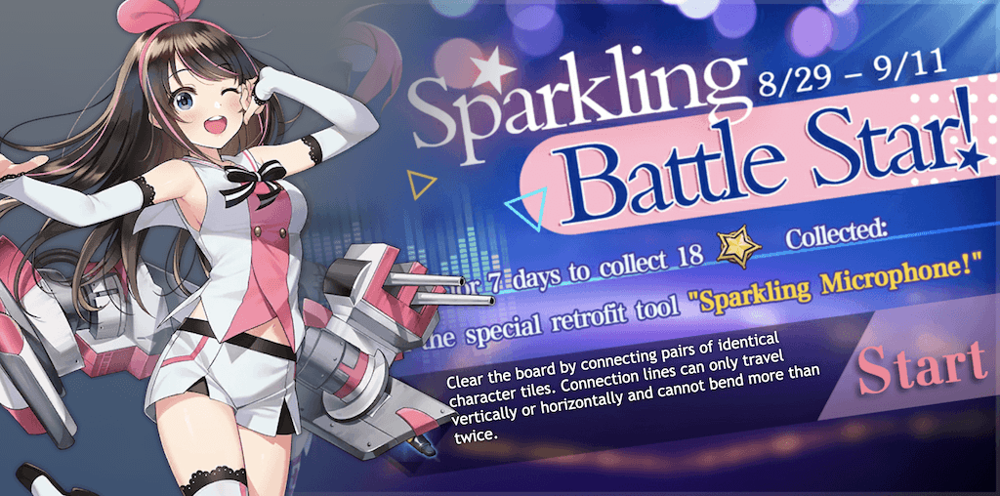

# Sandy

A clone of San Diego's retrofit event minigame from Azur Lane.

Most assets were taken from the [Azur Lane Wiki](https://azurlane.koumakan.jp/Azur_Lane_Wiki).

## Modes

I added two custom variations (VTuber and Meowfficer) of the game to this project.

To change modes, tap the banner sprite on the starting screen or results screen.

### Create Your Own Mode

To add a new mode:

- Fork this repository.
- Create a folder with the mode ID as its name (e.g. `default`, `vtuber`, `meow`).
- Put the mode's banner sprite in this folder and name it `0.png`.
- Put the tile sprites in this folder starting from `1.png`.
  - For an optimal layout, have a non-primary number of tiles.
- Edit `modes.js` by adding a new object to the `modes` array.
  - `key` is the mode ID.
  - `size` is the number of tiles.
  - `banner` is the CSS rules of `0.png` on the starting screen.
  - `result` is the CSS rules of `0.png` on the results screen.
- Enable GitHub Pages for your forked repo and enjoy.

## Progressive Web App (PWA)

This website is installable on iOS and Android as a standalone app.

To install, find the "Add to Homescreen" option in your device's browser.

Installing this PWA will:

- Make it available offline.
- Make it look a lot better with the address bar out of the way.

## Known Bugs

- Banner sprites may load slowly between mode changes.
- On iOS, it's possible to get stuck with a zoomed-in screen.
  - To fix this, just double-tap the rules text again.
  - If you started a game, reload the website to see the rules text.
  - I could fix this bug, but then the rules text would become unscrollable.
